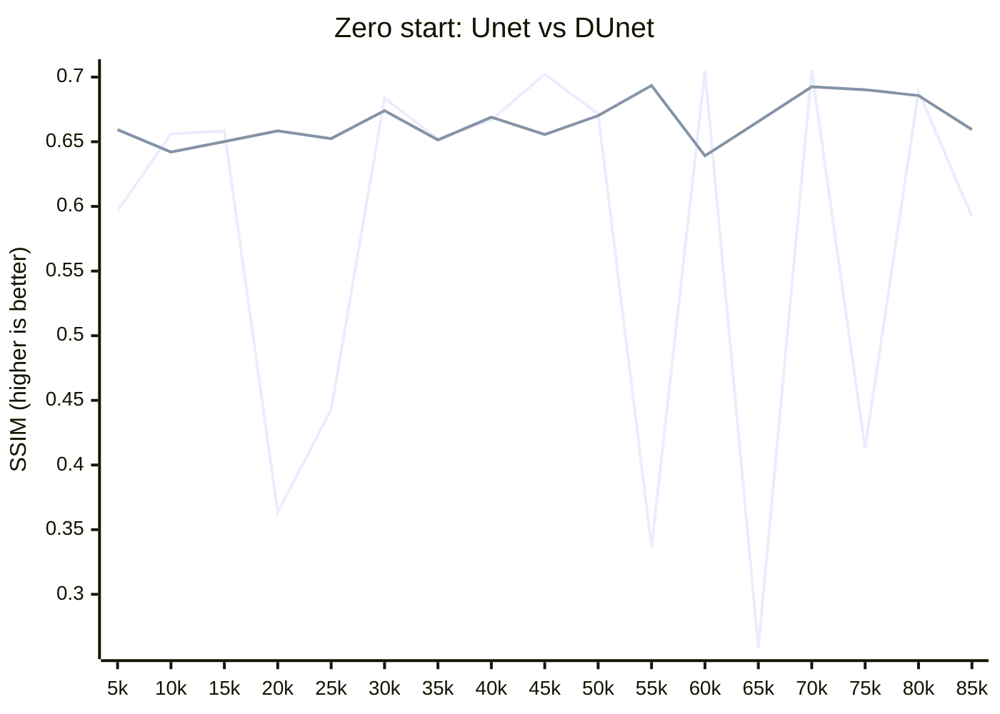
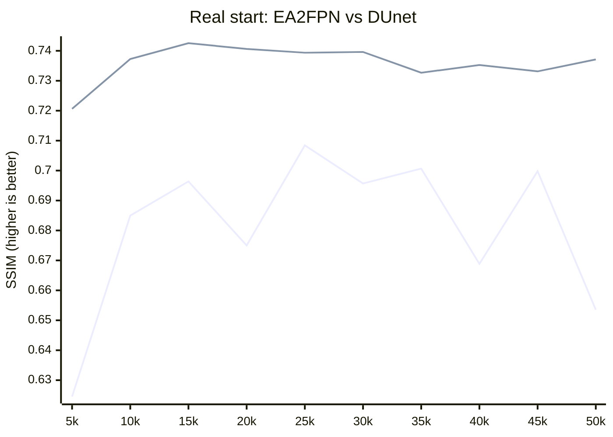

# DySample Unet
This project is an implementation of Unet with the DySample upsampler used in the decoding block. According to tests in the SR field as a GAN, this approach to semantic segmentation increases stability during cold start and the standard training process. All tests were conducted using [NeoSR](https://github.com/muslll/neosr) and the [SPAN](https://github.com/hongyuanyu/SPAN) SR architecture.

### blue - Unet | green - DUnet

### blue - EA2FPN | green - DUnet

